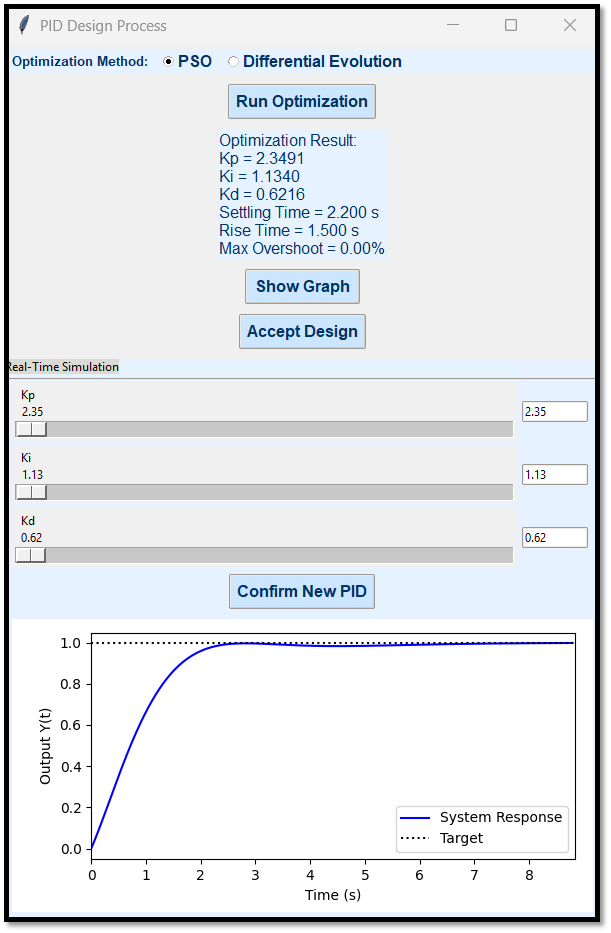

# SmartControlwithLLM

**SmartControlwithLLM** is a PID control design tool V1 integrated with LLM. This project aims to perform optimization and simulation of PID control systems in a GUI-based environment.

PID controllers are essential in control systems, yet traditional tuning methods often lead to issues like overshoot and oscillations; SmartControl overcomes these challenges by using a large language model to convert natural language performance requirements into precise numerical targets, automatically optimizing PID parameters with Particle Swarm Optimization and Differential Evolution, simulating closed-loop step responses, and providing interactive feedback, MATLAB code, and PDF reports for both academic and industrial applications.

## Features

- PID control design
- Optimization algorithms: PSO and Differential Evolution
- Real-time simulation and graphical visualization
- MATLAB code generation
- Project saving and loading

## Installation

1. Clone the repository:
   git clone https://github.com/ktohma/SmartControlwithLLM.git
   
2. Install the required dependencies:
   pip install -r requirements.txt
   
3. Create a `.env` file in the project's root directory and add your API key:
   OPENAI_API_KEY=Your_API_Key_Here

## Usage

Run the `SmartControlwithLLM.py` file from the terminal or through VS Code. The GUI will launch the PID design process.

SmartControl Input Interface and Initial GUI Screen:

Graphical Analysis of Closed-Loop Step Response:

PID Design Process: Optimization and Real-Time Simulation Interface:

## All Contributors

Iskenderun Techncal University, Computer Engineering , CS-NLP (Control Systems- Natural Language Processing) working group

#### WG members:

Prof. Dr. Celaleddin Yeroglu

Dr. Kadir Tohma

Dr. Handan Gursoy Demir

Dr. Merve Nilay Aydin

Dr. Halil Ibrahim Okur

## License

This project is distributed under the MIT License.

## Support

For any questions, please send an email to kadir.tohma@iste.edu.tr 
